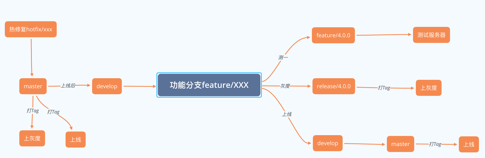
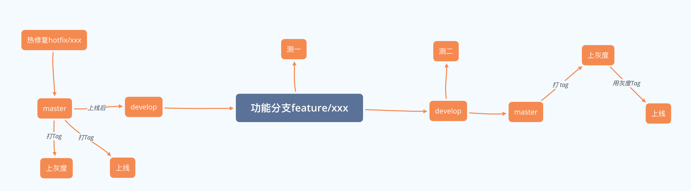

# 指南


::: tip 说明
- 像路由、接口、页面组件均是按模块分组的，所以在添加新的路由、页面和接口时，一定要放置到对应的模块。接口、路由等纯js内容的模块都通过 `index.js` 对外暴露。
- 项目配置了 `ESLint` ，严格规范代码，当你没有按照规则进行书写代码时（例如：每个文件最后必须留一个空行，js语句末尾不可以添加 `;` ，过程中不需要修改的变量使用 `const` 声明，需要修改的使用 `let` 声明），会报错，请根据错误修正代码格式，规范详情见[规范](#eslint在本项目中规范（部分）)。
:::

## 目录结构

```bash
├── build                      // 构建相关
├── config                     // 配置相关
├── src                        // 源代码
│   ├── api                    // 接口
│   ├── assets                 // 静态资源
│   ├── components             // 组件
│   ├── directive              // 指令
│   ├── emaoUI                 // emao UI库
│   ├── filters                // 过滤器
│   ├── iconFonts              // icon字体
│   ├── mixins                 // mixin
│   ├── plugin                 // 插件
│   ├── router                 // 路由
│   ├── store                  // vuex
│   ├── styles                 // 全局样式
│   ├── utils                  // 工具
│   └── main.js                // 入口文件
├── static                     // 第三方不打包资源
│   └── Tinymce                // 富文本
├── .babelrc                   // babel-loader 配置
├── .eslintrc.js               // eslint 配置项
├── .gitignore                 // git 忽略项
├── .travis.yml                // 自动化CI配置
├── favicon.ico                // favicon图标
├── index.html                 // html模板
└── package.json               // package.json
```

## 安装

```bash
# 克隆项目
git clone git@git.emao.net:pc/project-emao-admin.git

# 安装依赖
npm install # 或 yarn install

# 本地开发 启动项目
npm run dev # 或 yarn run dev
```

<br/>

::: tip
npm 安装速度慢的问题，可以使用 `cnpm`。
:::

```bash
## 安装cnpm
npm install --registry=https://registry.npm.taobao.org

## 下面就可以使用cnpm来安装依赖了，例如
cnpm install vue
```

## 启动

```bash
npm run dev
```
启动后会自动打开浏览器访问 http://0.0.0.0:9527，默认路径的 IP 为 `0.0.0.0`，你可以将 IP 改为你本机的 IP，其他跟你的电脑连着同一个 wifi 的电脑和手机就可以你的启动的这个工程了。

## 按照eslint规范格式化代码

```bash
npm run lint
```

## 编译

```bash
npm run build
```

## 上线

### 项目多分支并行开发上线



::: warning
1. feature/xxx功能分支，从develop分支拉取（同单分支开发）；
2. feature/4.0.0分支，从develop分支拉取；
3. release/4.0.0分支，从master分支拉取；
4. hotfix分支是热修复分支，目的是修复紧急bug，修复上线后，要将master分支合并develop分支，并通知其他人员，将develop分支合并到自己的功能分支（同单分支开发）；
5. 测一、上灰度、上线前，做每个动作的时候，都要确认一下其他小组的分支有没有在目标分支，有的话注意修改上线配置。
:::

### 项目单分支开发上线



::: warning
单分支开发，上线时的tag就用灰度最后一版的tag，无需重新打。
:::

## 贡献

本文档项目地址 [eMao-Admin-Doc](https://gitlab.com/recoluan/emaoadmindoc) 基于 [vuepress](https://github.com/vuejs/vuepress)开发。如果你觉得文档有需要优化的地方，请提交你的修改。

## 其他

### Fetch

本项目的数据请求，摈弃ajax，拥抱fetch。依赖于 [reco-fetch](https://recoluan.gitlab.io/views/frontEnd/2018/091301.html)，具体使用见项目目录 `/src/utils/fetch.js`。

fetch本身是不同于ajax的XNLHttpRequest，所以在报错或者遇到问题时，可能不像ajax有那么完整的报错，所以希望大家转变思维，如果入到请求问题，从fetch角度去解决问题。

1. fetch本身没有状态码，是后期手动加入的
2. 未完待续。。。

### ESLint在本项目中规范（部分）

1. js语句末尾不得添加 `;` 
2. 不能声明没有使用的变量，如果确实要声明，请挂在到window对象上，或者本页面组件的data钩子上
3. 引号必须要使用单引号
4. 函数声明时的小括号两边需要留有空格
5. 代码行与行之间最多空一行，空行里不能有空格

