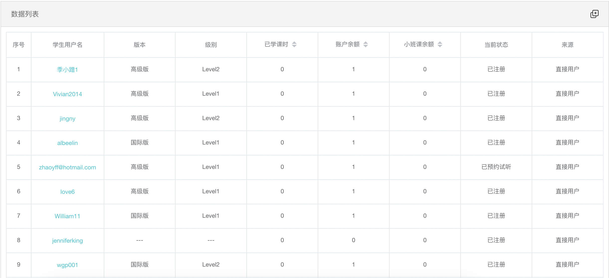
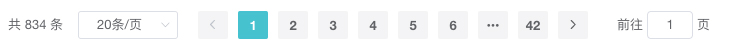
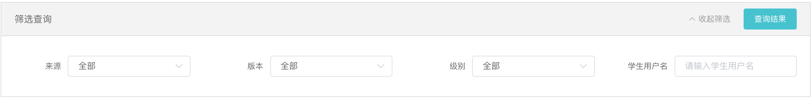

# customUI

## 卡片

**效果**



**使用**

```html
<!-- 通过icon和title自定义标题内容和图标 -->
<custom-card title="数据列表">
  <div slot="header-right">
    <!-- 标题右侧自定义内容 -->
    <el-button type="primary">添加按钮和操作</el-button>
  </div>
  <!-- 内容 -->
</custom-card>
```

**参数**

1. icon (String) 图标
2. title (String) 标题
3. header-right (slot) 自定义标题栏右侧内容

## 分页

**效果**



**使用**

```html
<custom-pagination 
  :total="total" 
  :current-page="currentPage" 
  @getCurrentPage="getCurrentPage"
  @getPerPage="getPerPage"></custom-pagination>
```

**参数**

1. total (Number) 总共多少条数据
2. current-page (Number) 当前页面
3. getCurrentPage (Function) 切换页面后，获取当前是第几页
4. getPerPage (Function) 切换每夜展示的条数时，获取当前每页展示多少条数据，默认是10

## 条件筛选

::: tip
根据  [custom-card](#卡片)二次开发，配合[screen-item](#条件筛选子元素) 使用
:::

**效果**



**使用**

```html
<screen-wrapper @search="search">
  <screen-item label="来源">
    <el-input v-model="input" placeholder="请输入内容"></el-input>
  </screen-item>
  <screen-item label="版本">
    <el-input v-model="input" placeholder="请输入内容"></el-input>
  </screen-item>
  <screen-item label="学生用户名">
    <el-input v-model="input" placeholder="请输入学生用户名"></el-input>
  </screen-item>
</screen-wrapper>
```

**参数**
1. search (Function) 点击查询按钮触发的函数
