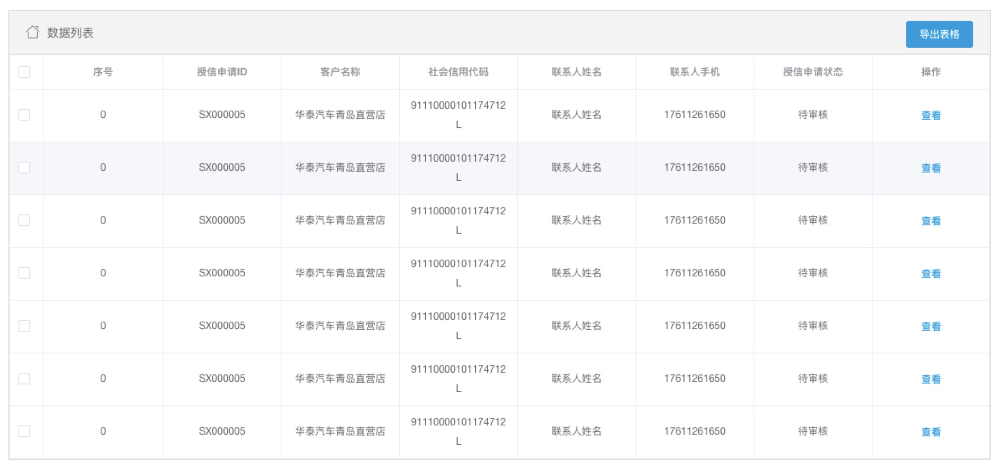
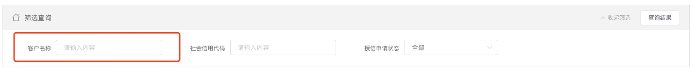
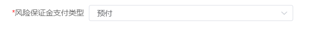
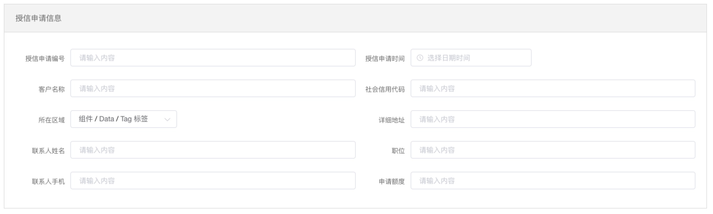
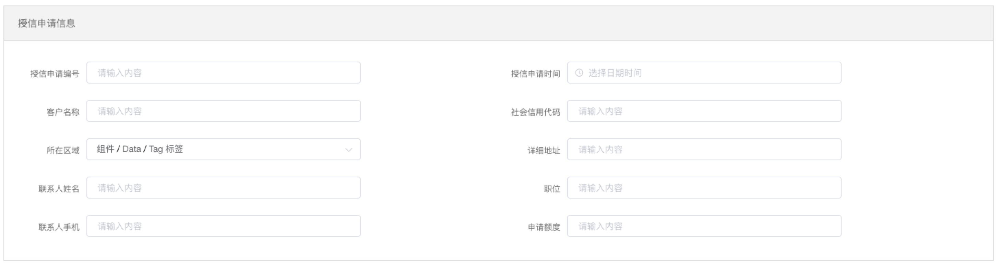
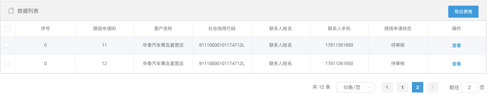
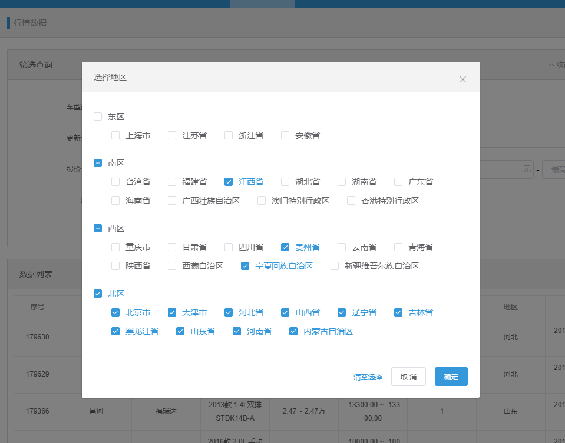

# emaoUI

## 卡片

**效果**



**使用**

```html
<!-- 通过icon和title自定义标题内容和图标 -->
<emao-card icon="icon-home" title="数据列表">
  <div slot="header-right">
    <!-- 标题右侧自定义内容 -->
    <el-button type="primary">导出表格</el-button>
  </div>
  <!-- 内容 -->
</emao-card>
```

**参数**

1. icon (String) 图标
2. title (String) 标题
3. header-right (slot) 自定义标题栏右侧内容

## 屏幕自适应的多栏布局

**效果**



**使用**

```html
<!-- 通过part自定义占比的分母n -->
<el-row>
  <emao-grid-item :part="2" class="screen-item-wrapper flex-wrapper">
    <!-- 内容 -->
  </emao-grid-item>
</el-row>
```

**参数**

1. part (Number) 自定义占比

## 分页

**效果**


**使用**

```html
<emao-pagination 
  :total="total" 
  :current-page="currentPage" 
  @getCurrentPage="getCurrentPage"
  @getPerPage="getPerPage"></emao-pagination>
```

**参数**

1. total (Number) 总共多少条数据
2. current-page (Number) 当前页面
3. getCurrentPage (Function) 切换页面后，获取当前是第几页
4. getPerPage (Function) 切换每夜展示的条数时，获取当前每页展示多少条数据，默认是10

## 条件筛选

::: tip
根据  [emao-card](#卡片)二次开发，配合[emao-screen-item](#条件筛选子元素) 使用
:::

**效果**


**使用**

```html
<emao-screen-wrapper @search="search">
  <emao-screen-item label="客户名称">
    <el-input v-model="input" placeholder="请输入内容"></el-input>
  </emao-screen-item>
  <emao-screen-item label="社会信用代码">
    <el-input v-model="input" placeholder="请输入内容"></el-input>
  </emao-screen-item>
</emao-screen-wrapper>
```

**参数**
1. search (Function) 点击查询按钮触发的函数

## 条件筛选子元素

::: tip
根据 [emao-grid-item](#屏幕自适应的多栏布局) 二次开发，配合 [emao-screen-wrapper](#条件筛选) 使用
:::

**效果**


**使用**

```html
<emao-screen-item label="社会信用代码">
  <el-input v-model="input" placeholder="请输入内容"></el-input>
</emao-screen-item>
```

**参数**
1. label (String) 左侧label文案
2. part (Number) 自定义占比

**label前加 `*` 效果**
```
在emao-screen-item 标签上加 :star="true"即可
```



## 特殊两行表单布局

**效果**

美化前



美化后



**使用**

```html
<!-- 在外层加一个two-line-form类即可 -->
<emao-card title="授信申请信息" class="two-line-form">
  <el-row class="padding20">
    <emao-screen-item label="授信申请编号" :part="part">
      <el-input v-model="input" placeholder="请输入内容"></el-input>
    </emao-screen-item>
    <emao-screen-item label="授信申请时间" :part="part">
      <el-input v-model="input" placeholder="请输入内容"></el-input>
    </emao-screen-item>
  </el-row>
</emao-card>
```

## 多选表格

**效果**



**使用**

```html
<!-- 表格 -->
<template>
  <emao-card icon="icon-home" title="数据列表" class="table-wrapper">
    <div slot="header-right">
      <el-button type="primary">导出表格</el-button>
    </div>
    <el-table
      ref="multipleTable"
      :data="tableData"
      tooltip-effect="dark"
      :border="true"
      style="width: 100%"
      @select="singleSelectionChange"
      @select-all="allSelectionChange(tableData)">
      <el-table-column type="selection" width="40"></el-table-column>
      
    </el-table>
  </emao-card>
</template>

<script>
import multiSelect from '@/mixins/multiSelectTable.js'

export default {
  mixins: [multiSelect],
  data () {
    return {
      tableData: []
    }
  },
  methods: {
    // 获取当前页码
    getCurrentPage (currentPage) {
      getDataPromise().then(res => {
        this.$nextTick(() => {
          this._restoreSelected(this.tableData, 'multipleTable', 'id')
        })
      })
    },
    // 表格单个选择
    singleSelectionChange (selection, row) {
      this._dealSeclect(row, 'id')
    },
    // 表格全选
    allSelectionChange (tableData) {
      this._dealSeclect(tableData, 'id')
    }
  }
}  
</script>
```

## 预览功能

**使用**

预览中的放大缩小以及旋转功能目前还有一些问题有待后续优化(例如：当用户上传的图片过宽或过高时放大的边界处理)
```html
<!-- 表格 -->
<template>
  <div @click="openPreview">打开预览</div>
</template>

<script>
export default {
  methods: {
    openPreview () {
      this.$showPreview({
        // 是否显示预览
        isShow: true,
        // 1图片 2视频 3音频 4PDF 5office文件
        fileType: 1,
        // 接受字符串、数组和json对象
        previewData: [
          'https://ss1.baidu.com/6ONXsjip0QIZ8tyhnq/it/u=282609871,2046421540&fm=58&bpow=2048&bpoh=2745',
          'http://seopic.699pic.com/photo/50055/5642.jpg_wh1200.jpg',
        ],
        // 可选(没有这个参数时默认展示第一张), 预览多张图片中的某一张增加参数index(图片索引)
        index: 0
      })
    }
  }
}  
</script>
```

## 上传

**使用1.多图上传（有回显，有提交按钮）**

```html
<!-- 上传组件 -->
<upLoadBox
  :uploadtype="'picList'"
  :uploadapi="'https://xxx.xxx.com/scf/xxx/xxxx'"
  :limit="10"
  :uploadpiclist="uploadpiclist"
  ref="upLoadBox">
</upLoadBox>

<el-button type="primary" @click="submitBtn">提交</el-button>

<script>
import upLoadBox from '@/components/UpLoadBox'
export default {
  data () {
    uploadpiclist: []
  },
  components: {
    upLoadBox
  },
  methods: {
    // 点击提交按钮获取刚刚上传的图片列表数据
    submitBtn () {
      console.log('获取刚刚上传的图片列表', this.$refs.upLoadBox.uploadPiclist)
      console.log('图片列表格式转换为数组', formatUploadOutputDataCode(this.$refs.upLoadBox.uploadPiclist))
    }
  }
}  
</script>
```

**参数**

1. uploadtype    (String) 上传组件的样式类型
2. uploadapi     (String) 上传接口地址
3. limit         (Number) 上传最大个数，默认10
4. uploadpiclist (Array)  父级页面默认回显的图片数组（多张图片必传）
5. fileType      (String) 上传时的文件类型限制
    - 1：图片
    - 2：视频
    - 3：音频
    - 4：pdf
    - 5：office
    - 5-1：word
    - 5-2：excel
    - 5-3：ppt
    - 6：Office+PDF

**使用2.表格中的按钮上传（单个文件）**

```html
<!-- 上传组件 -->
<upLoadBox
  @postUploadUrl_credit="postUploadUrl"
  :uploadtype="'textFile'"
  :uploadapi="'https://xxx.xxx.com/scf/xxx/xxxx'"
  :index="scope.$index"
  :limit="1"
  ref="upLoadBox">
</upLoadBox>

<script>
import upLoadBox from '@/components/UpLoadBox'
export default {
  components: {
    upLoadBox
  },
  methods: {
    // 文件上传成功，获取文件信息
    postUploadUrl (data, index) {
      console.log('获取当前行上传成功之后的文件信息，当前行下标', data, index)
    }
  }
}  
</script>
```

**参数**

1. uploadtype    (String) 上传组件的样式类型
2. uploadapi     (String) 上传接口地址
3. index         (String | Number) 当前行下标，用于表格中多行数据赋值
4. limit         (Number) 上传最大个数，默认10
5. fileType      (String) 上传时的文件类型限制
    - 1：图片
    - 2：视频
    - 3：音频
    - 4：pdf
    - 5：office
    - 5-1：word
    - 5-2：excel
    - 5-3：ppt
    - 6：Office+PDF

**使用3.表格中的按钮上传（多图上传，不回显，没有提交按钮）**

```html
<!-- 上传组件 -->
<upLoadBox
  @postUploadUrl="postUploadUrl"
  :uploadtype="'textPics'"
  :uploadapi="'https://xxx.xxx.com/scf/xxx/xxxx'"
  :list="uploadList"
  :limit="10"
  ref="upLoadBox">
</upLoadBox>

<el-button type="text" @click="delete">删除</el-button>

<script>
import upLoadBox from '@/components/UpLoadBox'
export default {
  data () {
    uploadList: []
  },
  components: {
    upLoadBox
  },
  methods: {
    // 图片上传成功，获取图片信息
    postUploadUrl (data) {
      console.log('获取刚刚上传的图片列表', data)
      console.log('图片列表格式转换为数组', formatUploadOutputDataCode(data))
    },
    // 删除图片列表
    delete () {
      this.uploadList = []
    }
  }
}  
</script>
```

**参数**

1. uploadtype    (String) 上传组件的样式类型
2. uploadapi     (String) 上传接口地址
3. list          (Array)  向子级出入数组，方便子级接收，方便父级清空
4. limit         (Number) 上传最大个数，默认10
5. fileType      (String) 上传时的文件类型限制
    - 1：图片
    - 2：视频
    - 3：音频
    - 4：pdf
    - 5：office
    - 5-1：word
    - 5-2：excel
    - 5-3：ppt
    - 6：Office+PDF

**使用4.表格中的按钮上传（单个图片）**

```html
<!-- 上传组件 -->
<upLoadBox
  @postUploadUrl="postUploadUrl"
  :uploadtype="'textPic'"
  :uploadapi="'https://xxx.xxx.com/scf/xxx/xxxx'"
  :limit="1"
  ref="upLoadBox">
</upLoadBox>


<script>
import upLoadBox from '@/components/UpLoadBox'
export default {
  components: {
    upLoadBox
  },
  methods: {
    // 图片上传成功，获取图片路径
    postUploadUrl (data) {
      console.log('获取刚刚上传的图片列表', data)
    }
  }
}  
</script>
```

**参数**

1. uploadtype    (String) 上传组件的样式类型
2. uploadapi     (String) 上传接口地址
3. limit         (Number) 上传最大个数，默认10
4. fileType      (String) 上传时的文件类型限制
    - 1：图片
    - 2：视频
    - 3：音频
    - 4：pdf
    - 5：office
    - 5-1：word
    - 5-2：excel
    - 5-3：ppt
    - 6：Office+PDF

## 图标选择组件

```html
<emao-icon-picker @iconSelected="iconSelected"></emao-icon-picker>

<script>
export default {
  components: {
    upLoadBox
  },
  methods: {
    iconSelected (icon) {
      // icon指的是选择后的icon
    },
  }
}  
</script>
```

## 地区分区多选组件

分东南西北大区的省份（地区）选择组件



**使用方法**

```html
<emao-screen-item label="地区：" :part="1">
  <emao-area-check-box @change="areasChange"></emao-area-check-box>
</emao-screen-item>

<script>
export default {
  methods: {
    areasChange (val) {
      // val是选择后的地区数组id
    }
  }
}  
</script>
```